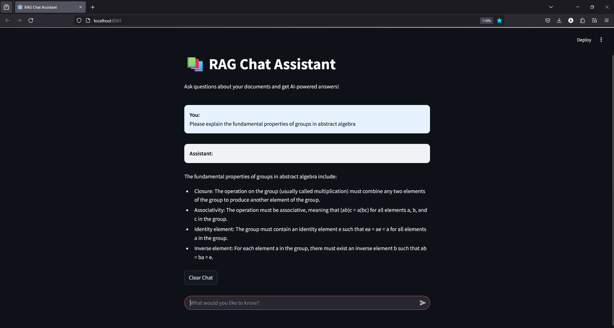

# RAG Chat Assistant with Gemini Pro

A simple implementation of Retrieval-Augmented Generation (RAG) that lets you chat with your PDF documents using Google's Gemini Pro API.

## Quick Start

1. Install dependencies
```bash
pip install -r requirements.txt
```

2. Set up Gemini API
- Get your API key from [Google AI Studio](https://aistudio.google.com/apikey)
- Create a file named `api` in the root directory
- Paste your API key into the file

3. Add your documents
- Place your PDF files in the `data` directory
- Initialize the database:
```bash
python populate_database.py
```

4. Start chatting
```bash
streamlit run app.py
```

## Tech Stack
- LangChain for document processing
- ChromaDB for vector storage
- Streamlit for the chat interface
- Google Gemini Pro for embeddings and text generation