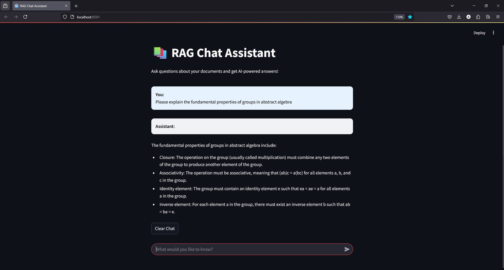

# RAG Chat Assistant with Gemma

A simple implementation of Retrieval-Augmented Generation (RAG) that lets you chat with your PDF documents using the Gemma model running locally via Ollama.



## Prerequisites

1. **Install Ollama**
   - Download and install Ollama from [ollama.ai](https://ollama.ai/)
   - Make sure Ollama is running in the background

2. **Pull the Gemma model**
   ```bash
   ollama pull gemma:2b
   # or for better performance (requires more RAM):
   ollama pull gemma:7b
   ```

3. **Optional: Pull an embedding model for Ollama** (if you want to use Ollama embeddings)
   ```bash
   ollama pull nomic-embed-text
   ```

## Quick Start

1. Install dependencies
```bash
pip install -r requirements.txt
```

2. Add your documents
- Place your PDF files in the `data` directory
- Initialize the database:
```bash
python populate_database.py
```

3. Start chatting
```bash
streamlit run app.py
```

## Tech Stack
- **LangChain** for document processing
- **ChromaDB** for vector storage
- **Streamlit** for the chat interface
- **Gemma** (via Ollama) for text generation
- **SentenceTransformers** for embeddings (default)
- **Ollama** for local model inference

## Configuration Options

### Embedding Models
The application uses SentenceTransformers by default for embeddings. You can modify `get_embedding_function.py` to use:
- `all-MiniLM-L6-v2` (default, lightweight)
- `all-mpnet-base-v2` (better quality, larger)
- Ollama embeddings with `nomic-embed-text`

### Gemma Model Variants
- `gemma:2b` - Faster, less RAM usage
- `gemma:7b` - Better quality, more RAM usage

## Performance Notes

- The first query may take longer as models are loaded
- Gemma 2B requires ~3GB RAM
- Gemma 7B requires ~8GB RAM
- SentenceTransformers embeddings are cached after first use

## Troubleshooting

1. **Ollama not found**: Make sure Ollama is installed and running
2. **Model not found**: Run `ollama pull gemma:2b` first
3. **Out of memory**: Try using `gemma:2b` instead of `gemma:7b`
4. **Slow performance**: Ensure you have sufficient RAM and consider using a GPU-enabled setup